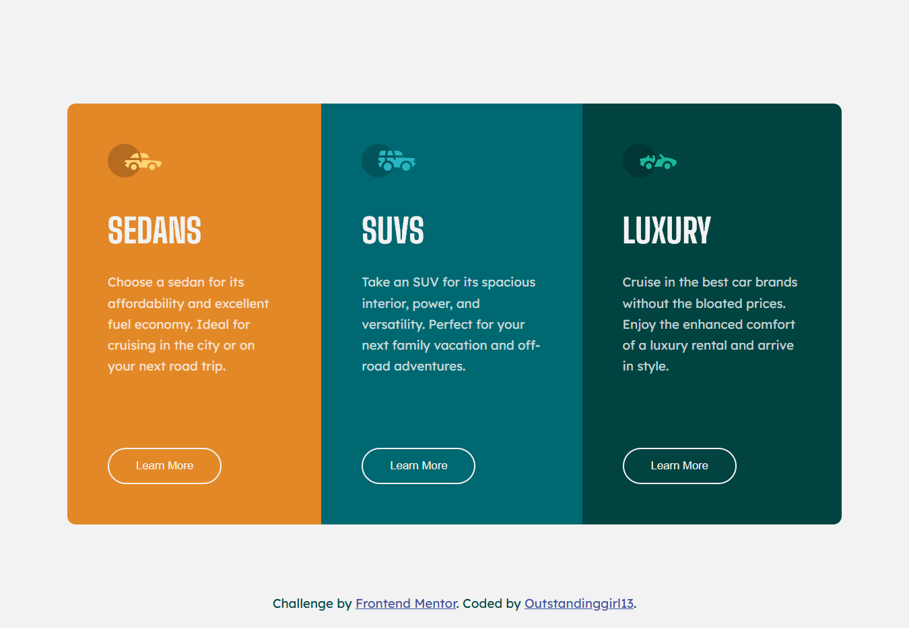

# Frontend Mentor - 3-column preview card component solution

This is a solution to the [3-column preview card component challenge on Frontend Mentor](https://www.frontendmentor.io/challenges/3column-preview-card-component-pH92eAR2-). Frontend Mentor challenges help you improve your coding skills by building realistic projects. 

## Table of contents

- [Overview](#overview)
  - [The challenge](#the-challenge)
  - [Screenshot](#screenshot)
  - [Links](#links)
- [My process](#my-process)
  - [Built with](#built-with)
  - [What I learned](#what-i-learned)
- [Author](#author)

## Overview

### The challenge

Users should be able to:

- View the optimal layout depending on their device's screen size
- See hover states for interactive elements

### Screenshot



### Links

- Solution URL: [Responsive Car Rental Options – Sedans, SUVs & Luxury](https://www.frontendmentor.io/solutions/responsive-car-rental-options-sedans-suvs-and-luxury-VDDE4rmORo)
- Live Site URL: [GitHub Pages](https://outstandinggirl13.github.io/3-column-preview-card-component-main/)

## My process

### Built with

- Semantic HTML5 markup
- CSS custom properties
- Flexbox

### What I learned

1. Centering the entire card component

```css
.section__card-component {
    display: flex;
    justify-content: center;
    align-items: center;
    height: 100vh;
}
```
- display: flex; turns the ```<section>``` into a flex container.
- ```justify-content: center;``` moves the child element (the ```<ul>```) to the horizontal center.
- ```align-items: center;``` moves it to the vertical center.
- ```height: 100vh;``` ensures the section fills the full viewport height, so the centering works properly.

👉 This makes the whole 3-card component sit perfectly in the middle of the screen.

2. Arranging the cards side by side

```css
.card-component__items {
    display: flex;
    flex-direction: row;
    list-style: none;
    width: 57.5rem;
    border-radius: 10px;
    overflow: hidden;
}
```
- ```display: flex;``` makes the ```<ul>``` a flex container.
- By default, ```flex-direction: row;``` arranges its children (```<li>``` cards) in a horizontal row.
- Each ```<li>``` becomes a flex item, so they sit next to each other.

👉 This is why the Sedans, SUVs, and Luxury cards appear in a single row instead of stacking vertically.

3. Responsive adjustment
```css
@media (max-width: 37.5rem) {
    .card-component__items {
        flex-direction: column;
        width: 20.5rem;
    }

    .section__card-component {
        height: 100%;
        margin: 5.5rem 0;
    }
}
```
- On small screens, ```flex-direction: column;``` stacks the cards vertically.
- The width is reduced, so they look like a neat column instead of being squished.
- On desktop, the section was set to ```height: 100vh;``` so it always fills the entire viewport height and centers the cards vertically, but it's not the case in the mobile version (it breaks the whole design). On mobile, using ```height: 100%``` instead makes the section’s height shrink to fit its content (the stacked cards).

👉 This makes the layout responsive — adapting to both desktop (row) and mobile (column).

4. To create space inside each card between the content (```img, h2, p, button```) and the card’s border/background I used padding on the ```<li>``` elements:

```css
.card-component__items li {
    padding: 3rem;
}
```
- Every ```<li>``` inside ```.card-component__items``` gets ```3rem``` of padding on all four sides (top, right, bottom, left).
- The text and button do not touch the edges — giving the design breathing room and better readability.

👉 So, this is basically internal spacing for each card.

## Author

- Website - [Outstandinggirl13](https://github.com/Outstandinggirl13)
- Frontend Mentor - [@Outstandinggirl13](https://www.frontendmentor.io/profile/Outstandinggirl13)